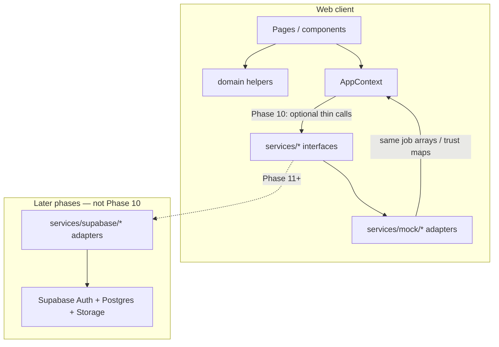
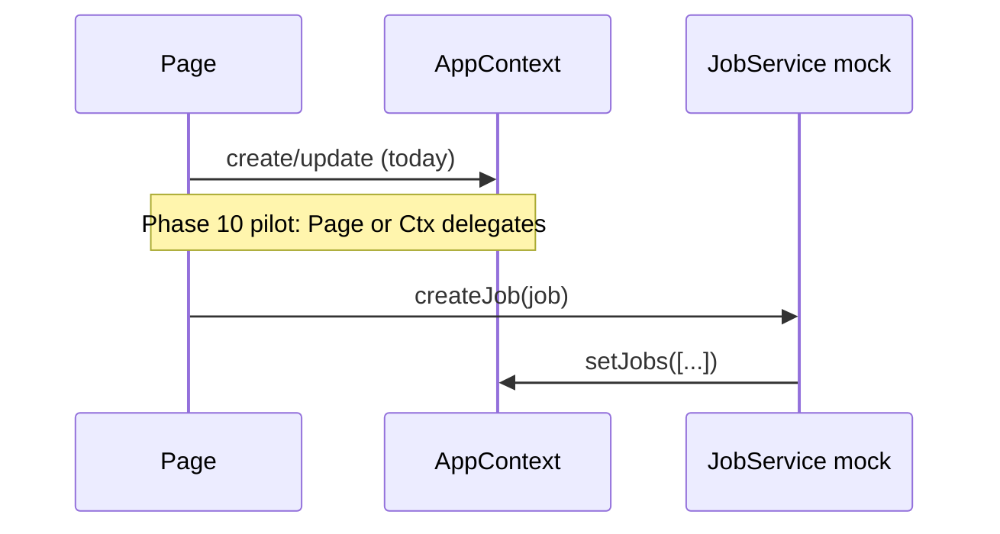

# RushBuddy — Data Access Layer (Phase 10 plan)

**Status:** Planning + interfaces first (Phase 10). Mock adapters only. No Supabase client, no real backend calls, no AppContext replacement.

**Sources of truth:**

- [`production-architecture.md`](./production-architecture.md) — mock vs target, migration path off AppContext
- [`schema-v1.md`](../database/schema-v1.md) — future tables this layer will eventually persist to
- [`notes/phase-9-summary.md`](../../notes/phase-9-summary.md) — Phase 9 lock-ins
- [`app/src/domain/types.ts`](../../app/src/domain/types.ts) — current domain shapes
- [`app/src/app/context/AppContext.tsx`](../../app/src/app/context/AppContext.tsx) — current in-memory state

---

## 1. Why this document exists

Phase 9 defined **what** to persist (orgs, jobs, events, payments, trust, disputes, photos, FIR). Phase 10 defines **how the client talks about persistence** without wiring a backend yet.

Today pages call `setJobs`, `appendTrustEvent`, and friends directly on `AppContext`. That couples UI to React state shape and blocks a clean Supabase swap later.

Goal:

1. Introduce **service interfaces** that mirror domain operations (jobs, payments, trust).
2. Implement them with **in-memory mock adapters** that read/write the same data AppContext already holds.
3. Keep UI behavior unchanged; wire at most **one small flow** through interfaces after they exist.
4. Leave a clear seam for a future `supabase/` adapter set.

**Non-goals of Phase 10:** Supabase SDK, Auth, RLS, SQL migrations, real payments/KYC, rewriting pages onto repositories en masse, editing MVP-locked Auth/Post UI beyond what a single pilot wire requires.

---

## 2. Layering



| Layer | Owns | Does not own |
|-------|------|--------------|
| `app/src/domain/` | Pure rules: pricing, eligibility, transitions, trust penalties, FIR builders | I/O, React state |
| `app/src/services/` | Async-capable APIs for load/create/update of durable concerns | Business rule formulas (call domain) |
| `AppContext` | Session UX state (`user`, `currentRole`, `activeJob`, `pendingSignup`) + **today’s** `jobs` / trust store | Long-term sole owner of job mutations (narrows over time) |
| Pages | UI + orchestration of domain + context/services | Direct knowledge of storage |

**Rule:** Domain stays pure. Services orchestrate persistence-shaped operations and may call domain helpers. Pages should not import mock or future Supabase modules directly — only `services` facades.

---

## 3. Interface principles

### 3.1 Shape like domain ops, not like SQL

Interfaces use today’s TypeScript domain types (`Job`, `TrustEvent`, `RunnerTrustRecord`, payment fields on `Job` for now). They do **not** require `organization_id` or split `Payment` / `Dispute` rows until domain types catch up (catalogued in Phase 9).

When schema catches up later:

- Keep interface method names stable where possible.
- Change DTOs / return types behind adapters.
- Prefer adding methods (`listJobEvents`) over breaking existing ones.

### 3.2 Async from day one

All service methods return `Promise<…>` even when mocks resolve immediately. Future network latency and errors must not force a second API redesign.

```ts
// Conceptual — concrete signatures live in app/src/services/types.ts (Slice 10.2+)
getJob(id: string): Promise<Job | null>;
```

### 3.3 Result / error style (lightweight)

Mocks may throw or return `null` for not-found, matching simple pilot use. Prefer:

| Case | Convention |
|------|------------|
| Not found | `null` |
| Business reject already handled by domain | Caller validates with domain first; service assumes valid write |
| Unexpected mock/store failure | `throw` Error (rare in mock) |

Do not invent a heavy Result monad in Phase 10.

### 3.4 What stays on AppContext (not services yet)

| Concern | Why |
|---------|-----|
| `user` / `setUser`, auth flags, `pendingSignup` | Session; real Auth is a later phase |
| `currentRole` | Client preference only |
| `activeJob` | Navigation/focus UX |
| Raw `setJobs` | Escape hatch while migration is incremental; new code prefers `JobService` |

Trust already has named mutators (`appendTrustEvent`, `updateRunnerTrustRecord`) — those are the first candidates to delegate to `TrustService` behind the same names.

### 3.5 God-`Job` vs future tables

Mock services may still mutate payment/dispute fields **on** `Job`, matching today’s AppContext. Interface docs name the **intent** (`recordPayment`, `fileDispute`) so a later adapter can write `payments` / `disputes` + `job_events` without renaming every call site.

---

## 4. Service surfaces (Phase 10)

Three interfaces ship first — matching phase deliverables and the hottest mock mutation clusters.

### 4.1 `JobService`

Maps to: create/list/update job lifecycle currently done via `setJobs`.

| Method (intent) | Today’s caller pattern | Future backend |
|-----------------|------------------------|----------------|
| `listJobs` / `getJob` | Read `jobs` from context | `SELECT` + RLS |
| `createJob` | `PostRequestPage` prepend | `INSERT jobs` + `job_events` |
| `updateJob` | Widespread status/field patches | `UPDATE` + event append |
| `acceptJob` (optional dedicated) | `RunnerFeedPage` MATCHED patch | Atomic accept race |
| `removeJob` / cancel | Rare filter-out paths | Status → cancelled/expired (when modelled) |

Domain remains responsible for: `computePriceFloor`, `computeExpiresAt`, `resolveHandoffMode`, `isJobPostingValid`, transition legality. Service persists the resulting `Job` snapshot.

**Phase 10 mock:** Operate on an in-memory `Job[]` shared with (or injected from) AppContext. Do not introduce a second source of truth.

### 4.2 `PaymentService`

Maps to: rating-time payment intent fields on `Job` (`payment_method`, `payment_status`, `paid_at`, `tip_amount`, `rating`).

| Method (intent) | Today | Future |
|-----------------|-------|--------|
| `recordPayment` | Patch job + tip at `RatingPage` | `INSERT payments` (+ `ratings`) + `job_events.payment_recorded` / `rating_recorded` |
| `getPaymentForJob` | Read fields off job | `SELECT payments WHERE job_id` |

No escrow, UPI verification, or provider refs in Phase 10. `provider_ref` stays unused.

### 4.3 `TrustService`

Maps to: `trustEvents` + `runnerTrustRecords` (+ user suspension mirrors).

| Method (intent) | Today | Future |
|-----------------|-------|--------|
| `appendEvent` | `appendTrustEvent` | `INSERT trust_events` |
| `getEventsForRunner` | Filter `trustEvents` | Indexed query |
| `getRunnerRecord` / `updateRunnerRecord` | `runnerTrustRecords` map | `users` aggregates + events |
| `setSuspension` | `setRunnerSuspension` helper | Same + event |

Domain helpers (`applyNoShowStrike`, `suspendRunner`, etc.) stay in `domain/`; service applies and stores the resulting record + event.

---

## 5. Explicitly deferred service surfaces

Do not implement these folders/interfaces in Phase 10 unless a later phase opens them:

| Concern | Reason |
|---------|--------|
| `AuthService` / org membership | Real Auth + `organizations` not in scope |
| `DisputeService` as separate CRUD | Still fields on `Job`; fold into `JobService.updateJob` or Payment flow for now |
| `PhotoService` | Still `mock://` strings on job |
| `FirExportService` | Ephemeral `buildFirExport`; no store |
| `JobEventService` | No `job_events` client type yet; mock can no-op or omit |
| `OrganizationService` | Domain types not added yet |

Document call-site intent in comments when mutating dispute/photo fields via `JobService` so cutover is obvious.

---

## 6. Module layout (deliverables)

```text
app/src/services/
  types.ts                 # JobService, PaymentService, TrustService interfaces
  index.ts                 # Factory / singleton getters → mock implementations
  mock/
    mockJobService.ts
    mockPaymentService.ts
    mockTrustService.ts
```

Later (not Phase 10):

```text
app/src/services/supabase/
  supabaseJobService.ts
  ...
```

`index.ts` exports a single composition root, e.g. `getServices()` returning `{ jobs, payments, trust }`, wired to mocks. Switching backend later is a one-line factory change, not a page rewrite.

### AppContext relationship (Step C from production architecture)

Preferred Phase 10 wiring order:

1. Define interfaces + mock classes that accept store accessors (`getJobs`, `setJobs`, …) or a shared in-memory store module.
2. Keep existing AppContext state as the backing store.
3. Optionally reimplement `appendTrustEvent` / one job write path to call the service (pilot wire).
4. Do **not** remove `jobs` / `setJobs` from context in this phase.



---

## 7. Migration path (extends Phase 9 §7)

| Step | Work | Phase |
|------|------|-------|
| A | Schema + seed org (docs → migrations) | Post–Phase 10 |
| **B** | **Repository/service interfaces mirroring domain ops** | **Phase 10** |
| **C** | **Mock adapters; AppContext remains backing store** | **Phase 10** |
| C′ | Wire ≤1 small UI/context flow through services | Phase 10 |
| D | Supabase Auth + membership | **In progress (Phase 12)** — registry hybrid: auth/org on Supabase when `VITE_DATA_ADAPTER=supabase`; jobs/payments/trust still mock; Auth/Verify page wire pending |
| E | Jobs + accept race + `job_events` | Later |
| F | Photos / payments / disputes / FIR persistence | Later |
| G | Real session replaces `defaultUser` | Later |
| H | Retire in-memory `jobs` once parity proven | Later |

**Hard rule:** Do not replace AppContext until mocks prove parity and pilot scenarios still run.

---

## 8. Privacy & security notes (client-side)

Even with mocks:

- Services must not invent APIs that return `gender` on runner cards or public feeds.
- `confirmation_code` remains on mock `Job` for pilot; production adapters will return hashes or role-scoped fields only (see production architecture §6).
- Trust/FIR payloads that include runner identity stay ops-oriented; do not broaden who can “list” them in the interface design.

---

## 9. Phase 10 slice map

| Slice | Deliverable | Notes |
|-------|-------------|--------|
| **10.1** | This document | Architecture only |
| **10.2** | `app/src/services/types.ts` | Interfaces only |
| **10.3** | `mockJobService.ts` + `mockPaymentService.ts` + `mockTrustService.ts` | In-memory |
| **10.4** | `app/src/services/index.ts` | Wire mocks |
| **10.5** | Optional: one small flow through a service | e.g. trust append or payment record — keep behavior identical |
| **10.6** | `notes/phase-10-summary.md` | End of phase |

---

## 10. Acceptance criteria (architecture doc)

- [x] Explains why a service boundary exists between UI/AppContext and future Supabase
- [x] Defines Job / Payment / Trust service intents aligned with current mutations and schema-v1 tables
- [x] States AppContext stays; mocks share its store; async interfaces; no Supabase in Phase 10
- [x] Lists deferred surfaces (auth, photos, FIR store, job_events, orgs)
- [x] Slice map for remaining Phase 10 code work
- [ ] Code deliverables — **not** Slice 10.1

---

## 11. Related docs

| Doc | Purpose |
|-----|---------|
| [`production-architecture.md`](./production-architecture.md) | System target + AppContext migration |
| [`schema-v1.md`](../database/schema-v1.md) | Tables adapters will eventually hit |
| [`phase-9-backend-foundation.md`](../plans/phase-9-backend-foundation.md) | Frontend type checklist for later |
| MVP locked fields | `.cursor/rules/mvp-locked-fields.mdc` |
