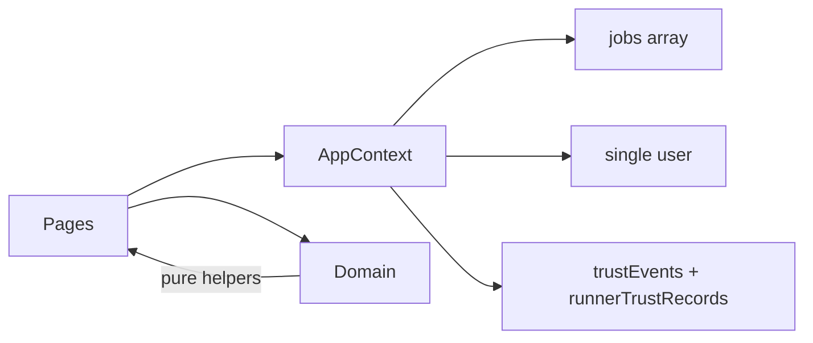
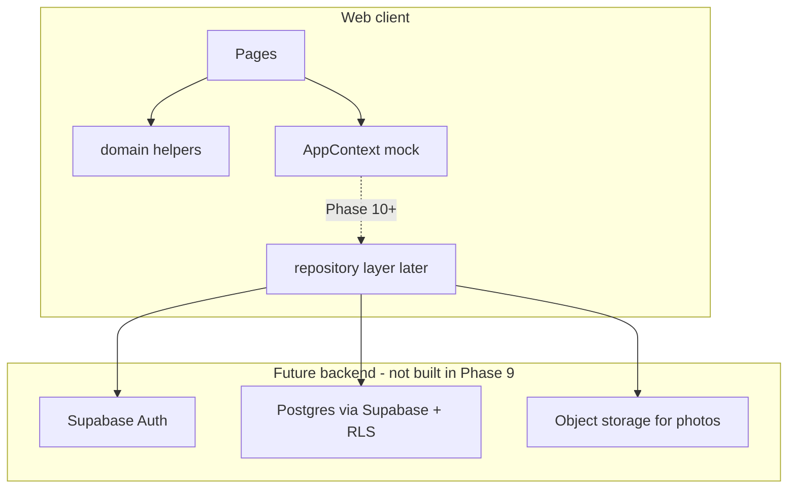
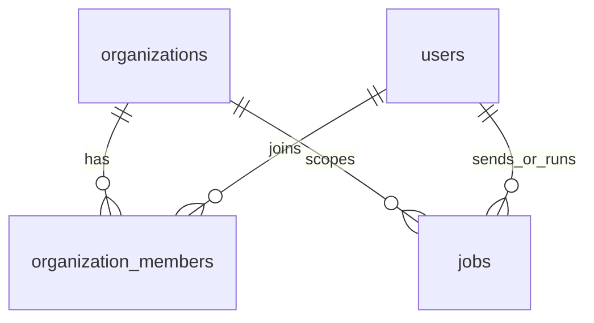

# RushBuddy — Production Architecture (v1 plan)

**Status:** Planning only (Phase 9). No Supabase client, no AppContext replacement, no migrations in this phase.

**Sources of truth:**

- [`docs/plans/sjt-mvp-core-loop.md`](../plans/sjt-mvp-core-loop.md) — locked business rules
- [`docs/product/core-flow-specs.md`](../product/core-flow-specs.md) — flow narratives (trust MVP + Phase 8 where they drift)
- [`app/src/domain/types.ts`](../../app/src/domain/types.ts) — current domain shapes
- [`notes/phase-8-summary.md`](../../notes/phase-8-summary.md) — pilot-hardened behavior
- [`docs/database/schema-v1.md`](../database/schema-v1.md) — table/column plan

---

## 1. Why this document exists

Phase 8 left a **pilot-testable in-memory mock**: refresh resets, single implied campus (VIT), payments/disputes embedded on `Job`, FIR built ephemerally, photos as `mock://` strings.

Phase 9 defines how RushBuddy becomes **launch-ready** without rewriting the UI yet:

1. Generalize from VIT-only to an **organization / community** model (VIT = one org).
2. Split the god-object `Job` into durable tables (jobs + events + payments + disputes + photos + FIR).
3. Keep pure domain helpers under `app/src/domain/`; swap persistence later.

---

## 2. Current state (mock)

| Concern | Today |
|---------|--------|
| Persistence | React state only; refresh wipes |
| Tenancy | Implicit VIT via `@vitstudent.ac.in` in Auth + copy |
| Users | One session user + `defaultUser`; no users collection |
| Jobs | `Job[]` with denormalized names, payment, dispute, photo URLs |
| Trust | In-memory `trustEvents` + `runnerTrustRecords` |
| Payments | Fields on `Job` (`payment_method`, `payment_status`, tip) |
| Disputes | Fields on `Job` + status `DISPUTED` |
| FIR | `buildFirExport(job)` → UI state; not stored |
| Photos | `photo_url` / `dropoff_photo_url` mock URLs |
| Multi-user | Same `u1` can play sender and runner via Home toggle |

---

## 3. Target architecture

### 3.1 Locked technology choices (for later implementation)

| Layer | Choice |
|-------|--------|
| Database | PostgreSQL (UUID PKs, `timestamptz`, snake_case columns) |
| Auth / API host | Supabase (Auth + PostgREST + Storage) — **planned, not wired** |
| Authorization | Row Level Security scoped by `organization_id` membership |
| Photos | Supabase Storage (or compatible object store); DB rows in `photos` |
| Domain rules | Stay in `app/src/domain/` (pricing, eligibility, transitions, policies) |
| Client state today | `AppContext` remains until an explicit later phase replaces it |

### 3.2 Boundaries

**Stays in the client (domain):**

- Price floor, expiry, handoff-mode resolution
- Runner visibility / gendered hostel rules
- Status transition graph
- Payment method allowlists, closure / dispute-window helpers
- Trust/FIR **builders** that assemble payloads from data (once data is real)

**Moves to the server (persistence + enforcement):**

- Auth, OTP / session
- Atomic job accept (race: first writer wins)
- Durable job timeline (`job_events`)
- Payment intent records, dispute case files, FIR exports, photo blobs
- Suspension / trust aggregates
- Email-domain allowlist from **organization config**, not a hardcoded VIT string in product core

**Out of V1 backend (same as product locks):**

- Escrow / verified settlement
- Real LE FIR filing (support package only)
- GPS live tracking product
- Multi-org membership for one user (schema allows; V1 enforces one org per user)

---

## 4. Organization / community model

RushBuddy is multi-community. An **organization** is a campus or peer community that:

- Owns a set of allowed signup email domains
- Scopes jobs, members, trust, and ops data
- Can later hold settings (hostel lists, feature flags) in `settings jsonb`

**VIT Vellore is a seed organization**, not the product:

| Field | Seed value |
|-------|------------|
| `slug` | `vit-vellore` |
| `display_name` | VIT Vellore |
| `email_domains` | `['vitstudent.ac.in']` |

Signup validation becomes: *email’s domain ∈ active org’s `email_domains`* (resolved by invite/org picker or single-org beta). Auth UI copy (“VIT BETA”) becomes **org-branded**, driven by the active organization.

### Membership

- V1: one active membership per user (`UNIQUE(user_id)` on members).
- Roles on membership: `member` | `ops` | `admin`.
- Home `current_role` (`sender` | `runner`) remains a **session preference**, not an org role.

---

## 5. Data architecture principles

### 5.1 Current-state + append-only events

| Store | Role |
|-------|------|
| `jobs` | Hot **current state** (status, parties, posting fields, no-answer flags, payout status) |
| `job_events` | Append-only timeline; reconstruct FIR / ops review without manual scrapbooking |
| Child tables | `payments`, `disputes`, `photos`, `fir_exports`, `trust_events` |

Every meaningful status tap, handoff attempt, no-answer branch, payment record, and ops action must emit a `job_event` (and, when applicable, a trust/dispute/payment row).

### 5.2 Stop stuffing `Job`

Today’s TypeScript `Job` is a UI-friendly aggregate. In production:

| Leave on `jobs` | Extract |
|-----------------|---------|
| Posting + lifecycle + no-answer hot fields | Payment intent → `payments` |
| Optional convenience FKs to latest photos | Dispute body → `disputes` |
| | Photo files → `photos` |
| | FIR packages → `fir_exports` |
| | Denormalized `sender_name` / `runner_name` → joins / views |

### 5.3 Spec drift (schema follows locked MVP)

When planning events and statuses, prefer:

1. Locked plan + Phase 8 (handoff code → `PENDING_RATING`; Low risk secure drop; Fragile/Valuable hold-for-ops)
2. Not stale Flow 4 “Confirm Delivery — Job Done” as the completion signal

---

## 6. Security & privacy

| Topic | Rule |
|-------|------|
| Gender | Stored for matching only; never on profiles, runner cards, public feeds; prefer server-side feed filtering so gender is not required in runner-facing payloads |
| Confirmation code | Stored hashed or access-restricted in production; never leak in runner feed list queries |
| RLS | All tenant tables include `organization_id`; policies: member of org may read/write per role |
| FIR exports | Ops/admin only; payload may include runner identity — treat as sensitive |
| Photos | Private buckets; signed URLs; `photos` rows scoped by org |

---

## 7. Migration path off AppContext

Ordered, **not** started in Phase 9 docs-only work:

| Step | Work |
|------|------|
| A | Schema + seed org (docs → migrations) |
| B | Introduce repository interfaces mirroring domain types |
| C | Keep `AppContext` as adapter implementing repos in-memory |
| D | Add Supabase Auth + profile/`organization_members` write path |
| E | Jobs CRUD + accept race + `job_events` writers |
| F | Photos storage; payments/disputes/FIR persistence |
| G | Replace mock seed / `defaultUser` with real session |
| H | Retire in-memory `jobs` array once parity is proven |

**Rule:** Do not replace `AppContext` until repositories exist and pilot scenarios still run.

---

## 8. Frontend type changes (later — catalog)

Do **not** edit `app/src/domain/types.ts` in Phase 9 docs. When code catches up:

| Area | Change |
|------|--------|
| New | `Organization`, `OrganizationMember` |
| `User` | Link via membership / `organization_id`; drop product-wide VIT email assumption |
| `Job` | Required `organization_id`; photo FKs optional; peel payment/dispute fields to dedicated types over time |
| New | `JobEvent`, `Payment`, `Dispute`, `Photo`; persist `FIRExport` as stored payload |
| Auth | Domain allowlist from org config |
| Eligibility | Same gender/location rules + must share org with the job |

Detail lives in [`docs/plans/phase-9-backend-foundation.md`](../plans/phase-9-backend-foundation.md).

---

## 9. Related docs

| Doc | Purpose |
|-----|---------|
| [`schema-v1.md`](../database/schema-v1.md) | Columns, FKs, indexes, seed |
| [`phase-9-backend-foundation.md`](../plans/phase-9-backend-foundation.md) | Phase slices & acceptance |
| [`sjt-mvp-core-loop.md`](../plans/sjt-mvp-core-loop.md) | Business locks |
| MVP locked fields rule | `.cursor/rules/mvp-locked-fields.mdc` — preserve Auth/Post UI when wiring |
