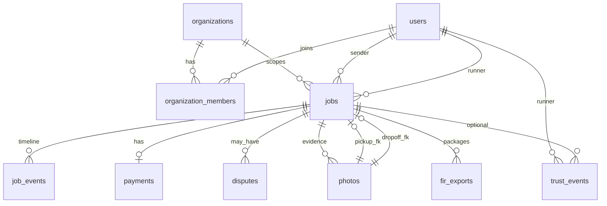

# RushBuddy — Database Schema v1 (plan)

**Status:** Planning only. No SQL migrations or Supabase project wiring in Phase 9.

**Companion:** [`docs/architecture/production-architecture.md`](../architecture/production-architecture.md)

**Maps from:** [`app/src/domain/types.ts`](../../app/src/domain/types.ts), [`app/src/domain/enums.ts`](../../app/src/domain/enums.ts)

**Conventions:** PostgreSQL; UUID primary keys; `timestamptz` for timestamps; snake_case; all tenant data carries `organization_id` where applicable.

---

## 1. Enumerations (Postgres enums or check constraints)

Align with domain enums unless noted.

| Name | Values |
|------|--------|
| `job_status` | `OPEN`, `MATCHED`, `IN_TRANSIT`, `DELIVERED`, `CLOSED`, `DISPUTED`, `ISSUE_REPORTED`, `PENDING_RATING` |
| `user_gender` | `male`, `female`, `prefer_not_to_say` |
| `suspension_status` | `active`, `suspended` |
| `job_type` | `campus_immediate`, `campus_scheduled`, `intercity` |
| `handoff_mode` | `mode_1_direct_p2p`, `mode_2_landmark` |
| `location_type` | `general`, `mens_hostel`, `womens_hostel` |
| `purchase_type` | `carry_only` |
| `item_type` | `Document`, `Food`, `Medicine`, `Object` |
| `weight_tier` | `Light`, `Medium`, `Heavy` |
| `risk_level` | `Low`, `Fragile`, `Valuable` |
| `payment_method` | `upi`, `phonepe`, `cash` |
| `payment_status` | `unpaid`, `paid`, `disputed` |
| `runner_payout_status` | `pending`, `earned`, `withheld`, `paid` |
| `org_status` | `active`, `paused` |
| `member_role` | `member`, `ops`, `admin` |
| `member_status` | `active`, `removed` |
| `dispute_status` | `open`, `under_review`, `resolved` |
| `dispute_resolution` | `runner_at_fault`, `sender_error`, `unclear` |
| `photo_kind` | `pickup`, `dropoff_secure`, `other` |
| `no_answer_resolution` | `secure_drop`, `hold_for_ops` |
| `trust_event_type` | `no_show`, `theft_escalation`, `dispute_filed`, `suspension`, `unsuspension`, `ops_note_added` |

### `job_event_type` (initial set)

`status_changed`, `pickup_acknowledged`, `handoff_code_attempt`, `handoff_code_success`, `handoff_code_locked`, `no_answer_started`, `contact_attempt`, `sender_responded`, `secure_drop`, `hold_for_ops`, `payment_recorded`, `dispute_filed`, `dispute_resolved`, `re_pooled`, `issue_reported`, `rating_recorded`, `ops_note`, `fir_exported`

---

## 2. Entity relationship overview



---

## 3. Tables

### 3.1 `organizations`

| Column | Type | Notes |
|--------|------|-------|
| `id` | `uuid` PK | |
| `slug` | `text` UNIQUE | e.g. `vit-vellore` |
| `display_name` | `text` | |
| `email_domains` | `text[]` | lowercase domains without `@` |
| `status` | `org_status` | default `active` |
| `settings` | `jsonb` | optional hostel list, feature flags |
| `created_at` | `timestamptz` | |
| `updated_at` | `timestamptz` | |

**Seed (VIT as one org, not product-wide hardcode):**

```text
slug: vit-vellore
display_name: VIT Vellore
email_domains: {vitstudent.ac.in}
status: active
```

---

### 3.2 `users`

Profile row. Auth identity (`auth.users` / Supabase) links via `auth_user_id` when implemented.

| Column | Type | Notes |
|--------|------|-------|
| `id` | `uuid` PK | |
| `auth_user_id` | `uuid` NULL UNIQUE | set when Auth is wired |
| `email` | `text` UNIQUE | |
| `name` | `text` | |
| `hostel_block` | `text` | free text; meaningful inside member’s org |
| `gender` | `user_gender` | matching-only; RLS / API must not expose to public UIs |
| `verified` | `boolean` | |
| `verified_at` | `timestamptz` NULL | |
| `rating` | `numeric(3,2)` | runner aggregate |
| `total_deliveries` | `int` | default 0 |
| `total_earnings` | `numeric(12,2)` | default 0 |
| `weekly_earnings` | `numeric(12,2)` | default 0 |
| `acceptance_rate` | `numeric(5,2)` | |
| `trust_score` | `numeric(5,2)` | display aggregate |
| `no_show_count` | `int` | default 0 |
| `suspension_status` | `suspension_status` | default `active` |
| `suspension_reason` | `text` NULL | |
| `suspended_at` | `timestamptz` NULL | |
| `streak` | `int` | default 0 |
| `best_week_earnings` | `numeric(12,2)` | default 0 |
| `joined_at` | `timestamptz` | |
| `created_at` | `timestamptz` | |
| `updated_at` | `timestamptz` | |

**Not stored as product constant:** VIT email domain — validated via org membership + `organizations.email_domains`.

**Session-only (not a DB column):** `current_role` (`sender` / `runner`) — client preference, as today.

---

### 3.3 `organization_members`

| Column | Type | Notes |
|--------|------|-------|
| `id` | `uuid` PK | |
| `organization_id` | `uuid` FK → organizations | |
| `user_id` | `uuid` FK → users | |
| `role` | `member_role` | default `member` |
| `status` | `member_status` | default `active` |
| `created_at` | `timestamptz` | |
| `updated_at` | `timestamptz` | |

**Constraints:**

- `UNIQUE (organization_id, user_id)`
- V1: `UNIQUE (user_id)` where `status = 'active'` (one org per user)

---

### 3.4 `jobs`

Current-state row. Denormalized `sender_name` / `runner_name` from today’s TS types become **joins** (optional materialized view for feed cards). Convenience photo FKs point at `photos`.

| Column | Type | Notes |
|--------|------|-------|
| `id` | `uuid` PK | |
| `organization_id` | `uuid` FK → organizations | **required** |
| `status` | `job_status` | |
| `sender_id` | `uuid` FK → users | |
| `runner_id` | `uuid` FK → users NULL | |
| `job_type` | `job_type` | |
| `handoff_mode` | `handoff_mode` | immutable after insert |
| `item_type` | `item_type` | |
| `weight` | `weight_tier` | |
| `risk` | `risk_level` | |
| `purchase_type` | `purchase_type` | V1 always `carry_only` |
| `pickup_location` | `text` | |
| `drop_location` | `text` | |
| `pickup_location_type` | `location_type` | |
| `drop_location_type` | `location_type` | |
| `description` | `text` | |
| `price_floor` | `numeric(12,2)` | immutable |
| `posted_price` | `numeric(12,2)` | ≥ floor |
| `agreed_price` | `numeric(12,2)` NULL | set at MATCHED |
| `confirmation_code_hash` | `text` | store hash in prod; plain only for mock |
| `corridor_landmark` | `text` NULL | Mode 2 |
| `receiver_phone` | `text` NULL | Mode 2 |
| `scheduled_window_start` | `timestamptz` NULL | campus_scheduled |
| `scheduled_window_end` | `timestamptz` NULL | |
| `travel_date` | `date` NULL | intercity |
| `expires_at` | `timestamptz` | |
| `condition_acknowledged` | `boolean` | default false |
| `pickup_photo_id` | `uuid` NULL FK → photos | replaces `photo_url` |
| `dropoff_photo_id` | `uuid` NULL FK → photos | replaces `dropoff_photo_url` |
| `no_answer_at` | `timestamptz` NULL | |
| `ops_notified` | `boolean` | default false |
| `no_answer_contact_attempts` | `int` | default 0 |
| `sender_response_at` | `timestamptz` NULL | |
| `no_answer_resolution` | `no_answer_resolution` NULL | |
| `dropoff_secure_location` | `text` NULL | |
| `dropoff_geotag` | `jsonb` NULL | `{lat,lng,accuracy_m,captured_at}` |
| `runner_payout_status` | `runner_payout_status` NULL | |
| `dispute_window_ends_at` | `timestamptz` NULL | |
| `declared_value` | `numeric(12,2)` NULL | ≤ 2000 |
| `matched_at` | `timestamptz` NULL | |
| `pickup_confirmed_at` | `timestamptz` NULL | |
| `delivered_at` | `timestamptz` NULL | handoff success / path complete |
| `closed_at` | `timestamptz` NULL | |
| `created_at` | `timestamptz` | |
| `updated_at` | `timestamptz` | |

**Moved off this table (see below):** payment method/status/paid_at/tip/rating; dispute_type/description/disputed_at; raw photo URL strings; FIR payload; ETA/distance display hints (client-only or ephemeral).

**Checks (application or DB):**

- Reject mixed `mens_hostel` + `womens_hostel` endpoints (same as `isJobPostingValid`)
- Mode 2 fields required when `handoff_mode = mode_2_landmark`
- Scheduled window end > start; intercity requires `travel_date`

---

### 3.5 `job_events`

Append-only. FIR timeline and ops reconstruction depend on this table + `photos`.

| Column | Type | Notes |
|--------|------|-------|
| `id` | `uuid` PK | |
| `organization_id` | `uuid` FK → organizations | denormalized for RLS |
| `job_id` | `uuid` FK → jobs | |
| `actor_user_id` | `uuid` FK → users NULL | system events null |
| `event_type` | `text` / enum | see `job_event_type` |
| `payload` | `jsonb` | status from/to, attempt count, notes, etc. |
| `created_at` | `timestamptz` | immutable |

**No updates/deletes** in application paths (ops may soft-redact later; not in v1).

---

### 3.6 `payments`

V1: off-platform payment **intent** recorded at rating time (one row per job).

| Column | Type | Notes |
|--------|------|-------|
| `id` | `uuid` PK | |
| `organization_id` | `uuid` FK | |
| `job_id` | `uuid` FK UNIQUE | one intent per job in V1 |
| `payer_id` | `uuid` FK → users | sender |
| `payee_id` | `uuid` FK → users | runner |
| `base_amount` | `numeric(12,2)` | agreed fee |
| `tip_amount` | `numeric(12,2)` | default 0 |
| `method` | `payment_method` | cash only Mode 1 policy |
| `status` | `payment_status` | |
| `provider_ref` | `text` NULL | future escrow / UPI verify |
| `recorded_at` | `timestamptz` | |
| `notes` | `text` NULL | |
| `created_at` | `timestamptz` | |

Rating stars may live on a future `ratings` table; until then store `rating` in `job_events` payload (`rating_recorded`) and optionally a thin `ratings` table in a later migration. V1 schema plan: **`rating` int on payment row optional** OR event-only — prefer **`ratings` deferred**; use `job_events` + optional columns on a small extension. For clarity in v1 plan, add:

#### 3.6b `ratings` (minimal)

| Column | Type | Notes |
|--------|------|-------|
| `id` | `uuid` PK | |
| `organization_id` | `uuid` FK | |
| `job_id` | `uuid` FK UNIQUE | |
| `rater_id` | `uuid` FK | sender |
| `ratee_id` | `uuid` FK | runner |
| `stars` | `int` | 1–5 |
| `created_at` | `timestamptz` | |

---

### 3.7 `trust_events`

Source of truth for trust/safety history (maps to domain `TrustEvent`).

| Column | Type | Notes |
|--------|------|-------|
| `id` | `uuid` PK | |
| `organization_id` | `uuid` FK | |
| `runner_id` | `uuid` FK → users | |
| `job_id` | `uuid` FK → jobs NULL | |
| `type` | `trust_event_type` | |
| `description` | `text` | |
| `created_at` | `timestamptz` | |

**Aggregates:** `users.no_show_count` / `suspension_*` updated on write (events remain authoritative history). Optional later: `runner_trust_snapshots` view.

---

### 3.8 `disputes`

Durable case file (domain today embeds fields on `Job`).

| Column | Type | Notes |
|--------|------|-------|
| `id` | `uuid` PK | |
| `organization_id` | `uuid` FK | |
| `job_id` | `uuid` FK | |
| `opened_by` | `uuid` FK → users | |
| `dispute_type` | `text` | damaged / not delivered / wrong item / etc. |
| `description` | `text` | |
| `status` | `dispute_status` | |
| `resolution_outcome` | `dispute_resolution` NULL | |
| `resolution_notes` | `text` NULL | |
| `resolved_by` | `uuid` FK NULL | ops user |
| `opened_at` | `timestamptz` | maps from `disputed_at` |
| `resolved_at` | `timestamptz` NULL | |
| `created_at` | `timestamptz` | |
| `updated_at` | `timestamptz` | |

Job `status = DISPUTED` remains; this row is the case file. V1 allows one open dispute per job (`UNIQUE` partial index on `job_id` where `status != 'resolved'` optional).

---

### 3.9 `fir_exports`

Persisted support packages (replaces ephemeral `buildFirExport` UI state).

| Column | Type | Notes |
|--------|------|-------|
| `id` | `uuid` PK | |
| `organization_id` | `uuid` FK | |
| `job_id` | `uuid` FK | |
| `generated_by` | `uuid` FK → users NULL | ops / system |
| `generated_at` | `timestamptz` | |
| `payload` | `jsonb` | shape ≈ domain `FIRExport` |
| `storage_path` | `text` NULL | optional PDF/JSON file later |
| `created_at` | `timestamptz` | |

---

### 3.10 `photos`

Replaces `mock://` URL strings.

| Column | Type | Notes |
|--------|------|-------|
| `id` | `uuid` PK | |
| `organization_id` | `uuid` FK | |
| `job_id` | `uuid` FK | |
| `kind` | `photo_kind` | |
| `storage_path` | `text` | bucket key |
| `captured_by` | `uuid` FK → users | |
| `captured_at` | `timestamptz` | |
| `geotag` | `jsonb` NULL | |
| `metadata` | `jsonb` NULL | mime, size, device |
| `created_at` | `timestamptz` | |

Circular FK note: create `photos` without requiring job photo FKs first; add `jobs.pickup_photo_id` / `dropoff_photo_id` as nullable FKs after both tables exist (or defer FKs and use soft references).

---

## 4. Indexes (planned)

| Index | Purpose |
|-------|---------|
| `jobs (organization_id, status)` | Feed / open jobs |
| `jobs (organization_id, sender_id, status)` | Sender home |
| `jobs (organization_id, runner_id, status)` | Runner home |
| `jobs (organization_id, expires_at)` WHERE `status = 'OPEN'` | Expiry workers |
| `job_events (job_id, created_at)` | Timeline / FIR |
| `trust_events (runner_id, created_at)` | Trust history |
| `organization_members (user_id)` | Session → org |
| `photos (job_id, kind)` | Evidence lookup |
| `disputes (organization_id, status)` | Ops queue |

---

## 5. RLS principles (document only)

1. Caller must have an `organization_members` row for `organization_id` with `status = active`.
2. Members read jobs in their org; writers constrained by role + ownership (sender posts; runner updates accepted job; ops wider).
3. `users.gender` not selected in policies serving public profiles / cards.
4. `fir_exports` and dispute resolution writes: `ops` / `admin` only.
5. `confirmation_code_hash` never returned on list endpoints.

Exact Supabase policies are a later implementation slice.

---

## 6. Mapping from today’s frontend types

| Domain today (`types.ts`) | Database v1 |
|---------------------------|-------------|
| — | `organizations`, `organization_members` |
| `User` | `users` (+ membership for org) |
| `User.current_role` | session / client only |
| `Job` posting + lifecycle + no-answer | `jobs` |
| `Job.sender_name`, `runner_name`, hostels, runner_rating | JOIN `users` (and rating column) |
| `Job.photo_url` / `dropoff_photo_url` | `photos` + optional FKs on `jobs` |
| `Job.payment_*`, `tip_amount` | `payments` |
| `Job.rating` | `ratings` (minimal) or event payload |
| `Job.dispute_*` | `disputes` |
| `Job.eta` / `distance` | not persisted (UI/mock) |
| `TrustEvent` | `trust_events` |
| `RunnerTrustRecord` | derived from `users` + `trust_events` |
| `FIRExport` | `fir_exports.payload` |
| — | `job_events` (new; required for ops/FIR) |

---

## 7. Out of schema v1

- Escrow ledgers, payout settlement providers
- Live GPS breadcrumbs (optional future `location_pings`)
- Proxy receiver tables (explicitly not in MVP)
- Multi-active-org membership (constraint enforces one; drop unique later)
- KYC / Aadhaar document store (V1.5+)

---

## 8. Acceptance for this doc

- [x] Org model with VIT as seed, not hardcode
- [x] Tables listed: users, organizations (+ members), jobs, job_events, payments, trust_events, disputes, fir_exports, photos (+ minimal ratings)
- [x] Frontend mapping called out for a later types change
- [ ] SQL migrations — **not** Phase 9
