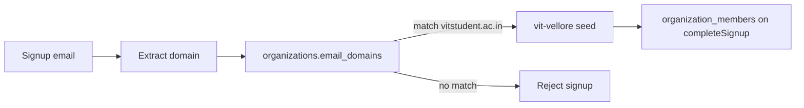

# Phase 12 — Supabase Auth + Organizations

**Goal:** Replace mock OTP (`123456`) with **Supabase Auth email OTP**, and persist identity into `public.users` + `organization_members`, while keeping **jobs / payments / trust** on mock adapters.

**Sources of truth:**

- [`notes/phase-10-summary.md`](../../notes/phase-10-summary.md) — `AuthService` / `OrganizationService` contracts + stubs
- [`notes/phase-11-summary.md`](../../notes/phase-11-summary.md) — schema migration + `vit-vellore` seed
- [`docs/architecture/production-architecture.md`](../architecture/production-architecture.md) — Step D (Auth + membership)
- [`docs/architecture/data-access-layer.md`](../architecture/data-access-layer.md)
- [`docs/database/schema-v1.md`](../database/schema-v1.md)
- [`docs/database/supabase-local-setup.md`](../database/supabase-local-setup.md)
- [`supabase/migrations/0001_initial_schema.sql`](../../supabase/migrations/0001_initial_schema.sql)
- [`supabase/seed.sql`](../../supabase/seed.sql)
- [`.cursor/rules/mvp-locked-fields.mdc`](../../.cursor/rules/mvp-locked-fields.mdc)

**Primary deliverables (this phase):**

1. This plan (**Slice 12.1** — docs only)
2. Supabase client + env (local keys from CLI status)
3. Real `AuthService` + `OrganizationService` adapters behind `services`
4. Auth → Verify wired through `beginSignup` / `completeSignup`
5. Profile row + active membership written on first verified signup
6. [`notes/phase-12-summary.md`](../../notes/phase-12-summary.md) at phase end

---

## Out of scope (Phase 12)

- Switching `JobService` / `PaymentService` / `TrustService` off mocks
- Jobs CRUD, accept races, `job_events` writers
- RLS policies for tenant tables (beyond whatever Auth session requires to insert/read own profile + membership)
- Storage / photos / KYC / real payments / FIR persistence
- Multi-org picker UI (V1 resolves a single org from email domain; beta = `vit-vellore`)
- Redesigning Auth / Verify / Post Request UI beyond wiring services
- Changing Post Request job types, location types, or editable offer price

---

## Slice map

| Slice | Deliverable | Status |
|-------|-------------|--------|
| **12.1** | This plan: slice map, auth flow, org resolution, mock boundaries, acceptance | **Done (this doc)** |
| **12.2** | Auth trigger + RLS migration (`0002_auth_profile_and_rls.sql`) + local setup note | **Done (SQL/docs; no app)** |
| **12.3** | Supabase browser client + env vars (`supabaseClient.ts`, `.env.example`) | **Done (client only; no adapters)** |
| **12.4** | Supabase `AuthService` + `OrganizationService` adapters + mappers (no page wiring) | **Done** |
| **12.5** | Registry hybrid swap (`VITE_DATA_ADAPTER=supabase` → auth/org adapters) | **Done** |
| **12.6** | Wire Auth + Verify through services (org domain check, begin/completeSignup; mock keeps OTP `123456`) | **Done** |
| **12.7** | Session hydrate on boot (`getCurrentUser`); sign-out clears Supabase session | **Done** |
| **12.8** | Phase summary (`notes/phase-12-summary.md`) + acceptance pass | End of phase |

**Do not start 12.2+ until 12.1 is reviewed.** Implementation slices may land as fewer PRs, but the map above is the canonical checklist.

---

## Current state (baseline)

| Surface | Today |
|---------|--------|
| `AuthPage` | Client checks `email.endsWith('@vitstudent.ac.in')`; writes `pendingSignup` (email, name, hostel_block, **gender**); navigates to `/verify` |
| `VerifyPage` | Accepts demo OTP **`123456`**; applies `pendingSignup` onto `defaultUser` via `setUser` / `setIsAuthenticated` |
| `services.auth` | Stub in `services/index.ts` — in-memory pending + mock user; **not** called from UI |
| `services.organizations` | Stub seeded with `vit-vellore` / `vitstudent.ac.in`; `getMembership` returns `null` |
| Jobs / payments / trust | Mock adapters; runner accept wired through `services.jobs.acceptJob` |
| DB | Phase 11 migration + seed; `public.users.auth_user_id` nullable; no Auth triggers yet |

---

## Target auth flow

Preserve the two-page UX and MVP fields. Move I/O behind `AuthService`.

```text
AuthPage
  collect: email, name, hostel_block, gender
  validate domain via OrganizationService (not a forever hardcode)
  set pendingSignup in AppContext (or equivalent) for Verify UI
  await services.auth.beginSignup(input)   → Supabase: signInWithOtp / email OTP
  navigate → /verify

VerifyPage
  collect: 6-digit OTP (real email OTP)
  await services.auth.completeSignup({ ...pendingSignup, token/otp })
       → Supabase: verifyOtp
       → upsert public.users (auth_user_id, email, name, hostel_block, gender, verified)
       → upsert organization_members (resolved org, role member, status active)
  setUser(session User) + setIsAuthenticated(true)
  navigate → /home
```

### Method mapping

| UI step | Service call | Backend effect |
|---------|--------------|----------------|
| Auth submit | `organizations.isEmailAllowed` / resolve-by-domain | Read `organizations` where `status = active` and domain ∈ `email_domains` |
| Auth submit | `auth.beginSignup(AuthSignupInput)` | Start email OTP for that address; **do not** create `public.users` yet |
| Verify submit | `auth.completeSignup(...)` | Verify OTP; create/link profile + membership; return `User` |
| App boot / refresh | `auth.getCurrentUser` / `isAuthenticated` | Session → `public.users` row (membership available via `organizations.getMembership`) |
| Sign out | `auth.signOut` | Clear Supabase session + AppContext auth state |

### `AuthSignupInput` (locked shape)

Already on the service contract — keep through Phase 12:

- `email`, `name`, `hostel_block`, `gender` (`male` \| `female` \| `prefer_not_to_say`)

Gender remains **matching-only**: stored on `public.users`, never shown on profile / runner cards / public feeds.

### OTP UX notes

- Resend on Verify should re-call the OTP send path (same email as `pendingSignup`).
- Attempt limits / lockout: prefer Supabase Auth rate limits; drop “demo OTP is 123456” copy when wired.
- Email confirm is the OTP itself — no separate password signup in V1.

---

## Org resolution

**Rule:** Signup email domain must match an **active** organization’s `email_domains` (lowercase, no `@`). VIT is a seed org, not the product identity.

| Step | Detail |
|------|--------|
| Parse | `domain = email.split('@')[1].toLowerCase()` |
| Lookup | `organizations` where `status = 'active'` and `domain = ANY(email_domains)` |
| Seed | `slug = vit-vellore`, id `01000000-0000-4000-8000-000000000001`, `email_domains = {vitstudent.ac.in}` ([`supabase/seed.sql`](../../supabase/seed.sql)) |
| Membership | On verified signup: insert `organization_members` with that `organization_id`, `role = member`, `status = active` |
| V1 constraint | One active membership per user (unique index already in migration) |

### Auth UI copy

- Prefer org-branded messaging when resolution succeeds (e.g. display name from resolved org).
- Reject unknown domains with a clear error (beta: only `vitstudent.ac.in` via seed).
- **Do not** keep a product-wide forever constant if the adapter can resolve from DB; a temporary client fallback during adapter swap is OK until `OrganizationService` is live.



---

## What stays mock

| Concern | Adapter | Notes |
|---------|---------|-------|
| Jobs lifecycle | `mockJobService` | Including accept already wired |
| Payments | `mockPaymentService` | Still patches `Job` fields |
| Trust | `mockTrustService` | In-memory events / records |
| Pilot job seed / `defaultUser` demo jobs | AppContext | Real session user replaces `defaultUser` for **auth identity** only; job list stays mock |
| Photos / disputes / FIR | N/A | Still mock-era fields / builders |

**Registry rule:** Swap **only** `auth` + `organizations` onto Supabase (env-gated). `createMockServices()` remains for jobs/payments/trust (or a hybrid factory: supabase auth/org + mock rest).

---

## MVP locked fields checklist

When 12.5 / 12.6 touch Auth / Verify, **preserve** every item (see [mvp-locked-fields](../../.cursor/rules/mvp-locked-fields.mdc)):

### Auth + Verify

- [ ] Email collection + org-domain gate (beta: `@vitstudent.ac.in` via seed)
- [ ] Full name required
- [ ] Hostel block required
- [ ] **Gender** picker: Male / Female / Prefer not to say → `male` \| `female` \| `prefer_not_to_say`
- [ ] Flow: Auth → `pendingSignup` (or equivalent) → Verify applies email, name, hostel_block, **gender** onto `User` / `public.users`
- [ ] Gender never shown on profile / runner cards / public UI

### Post Request (must remain untouched this phase)

- [ ] Three job types with locked definitions (`campus_immediate`, `campus_scheduled`, `intercity`)
- [ ] Scheduled window / intercity conditional fields
- [ ] Location types on pickup + drop (`general` \| `mens_hostel` \| `womens_hostel`)
- [ ] Editable offer price ≥ floor
- [ ] No hard-coded `job_type: 'campus_immediate'` on create

Phase 12 **must not** edit `PostRequestPage` unless a regression forces a one-line fix; even then, re-run the full locked checklist.

---

## Implementation notes (for 12.3–12.7)

1. **Client only in adapters** — pages import `@/services`, not `@supabase/*` directly.
2. **Profile write path (DB, Slice 12.2)** — `auth.users` INSERT trigger creates minimal `public.users` (`auth_user_id`, `email`, `verified`). After OTP, app UPDATEs `name` / `hostel_block` / `gender` (own row) or calls `complete_user_profile`, then `ensure_organization_membership`.
3. **Id strategy** — prefer `public.users.id` as app `User.id`; store `auth_user_id` for the Auth link. Avoid inventing a second identity in AppContext.
4. **RLS minimum (Slice 12.2)** — own `users` SELECT/UPDATE; member SELECT org; SELECT own `organization_members`. Membership INSERT via SECURITY DEFINER RPCs (no broad INSERT policy). Full tenant RLS for jobs is a later phase.
5. **Org resolve** — `resolve_organization_id_from_email` (SECURITY DEFINER; executable by `anon` + `authenticated`) for domain allowlist before/during signup.
6. **Existing stub** — delete or stop exporting stub auth/org once Supabase adapters are the registry default for those two keys under a real env.

---

## Acceptance criteria

### Slice 12.1 (this doc)

- [x] Slice map 12.1–12.8 written
- [x] Auth flow documented: AuthPage → `beginSignup` → VerifyPage → `completeSignup`
- [x] Org resolution documented: email domain → `organizations.email_domains` → `vit-vellore` seed
- [x] MVP locked fields checklist included (gender + Auth/Verify; Post Request untouched)
- [x] Mock boundaries explicit (jobs / payments / trust stay mock)
- [x] Phase acceptance criteria listed
- [x] No application code changes in 12.1

### Phase 12 (end state)

- [ ] Local Supabase Auth email OTP works end-to-end (send + verify); demo `123456` removed from Verify
- [ ] Verified signup creates/updates `public.users` with email, name, hostel_block, gender, `auth_user_id`, verified flags
- [ ] Verified signup creates `organization_members` for resolved org (`vit-vellore` for `@vitstudent.ac.in`)
- [ ] Unknown email domains rejected before OTP send
- [ ] `services.auth` / `services.organizations` used from Auth + Verify (no direct Supabase imports in pages)
- [ ] `services.jobs` / `payments` / `trust` still mock; runner accept still works
- [ ] Gender still collected on Auth, persisted on verify, never shown on public profile/feed UI
- [ ] Post Request MVP controls unchanged
- [ ] `notes/phase-12-summary.md` written
- [ ] `cd app && pnpm build` green

---

## Validation (docs slice 12.1)

1. Open this file; confirm links resolve under `docs/` / `notes/` / `supabase/` / `.cursor/rules/`.
2. Confirm no `app/src` edits landed with 12.1.
3. Confirm slice map covers client, org adapter, auth adapter, Auth wire, Verify wire, session, summary.

---

## Risks / notes

- Auth email delivery in local Supabase uses Inbucket / Mailpit (see CLI status); document the inbox URL in 12.2 setup notes if not already obvious from Phase 11 docs.
- Hardcoded `@vitstudent.ac.in` on `AuthPage` must become org-domain resolution without dropping the beta gate.
- Partial hybrid registry (supabase auth + mock jobs) means `User.id` from DB must still be acceptable to mock job accept (`runner.id`) — keep UUID string compatibility.
- Spec drift: Flow 4 / KYC remain out of scope; V1 pilot auth is email OTP + org membership only.
)
